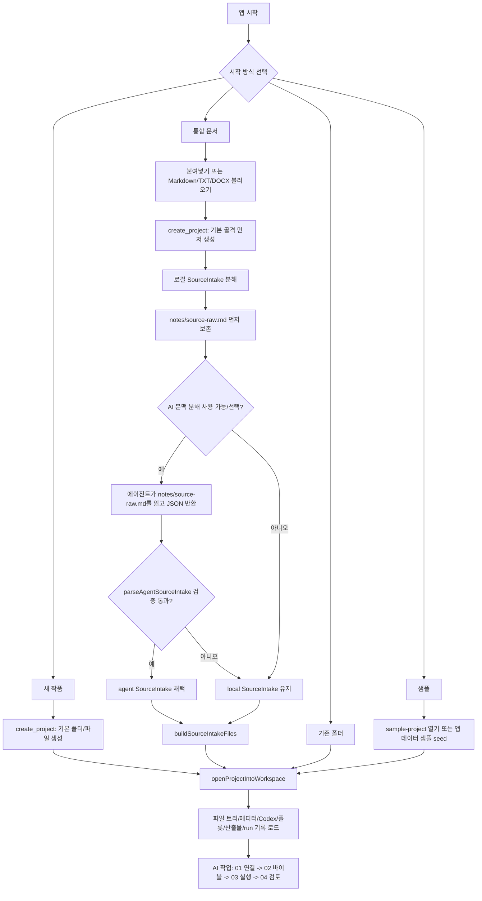
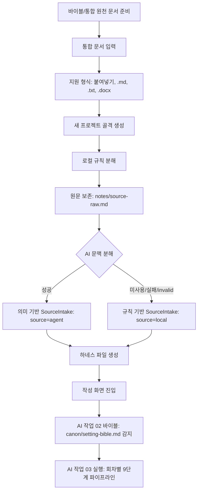
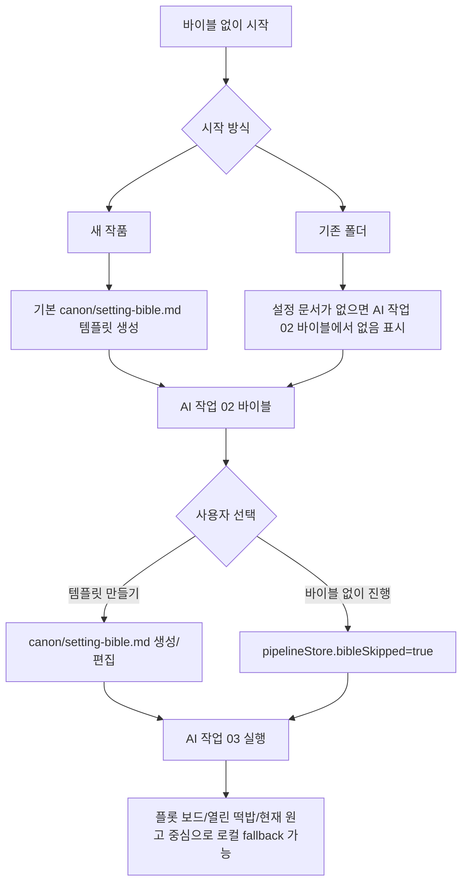
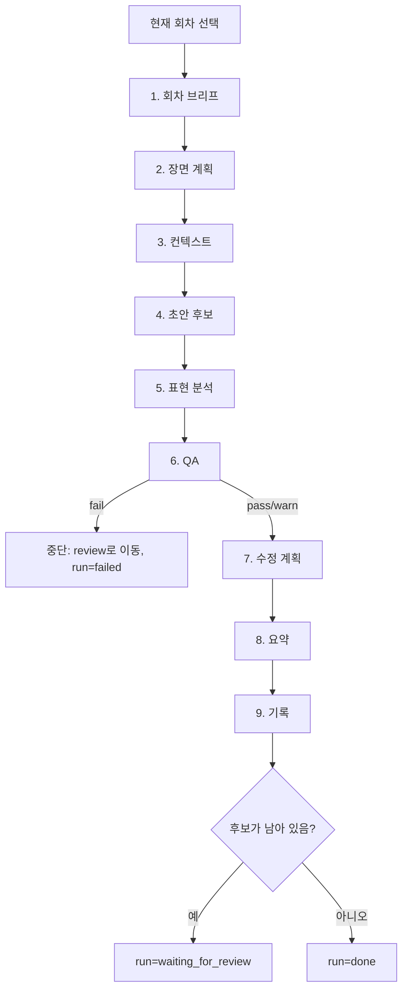
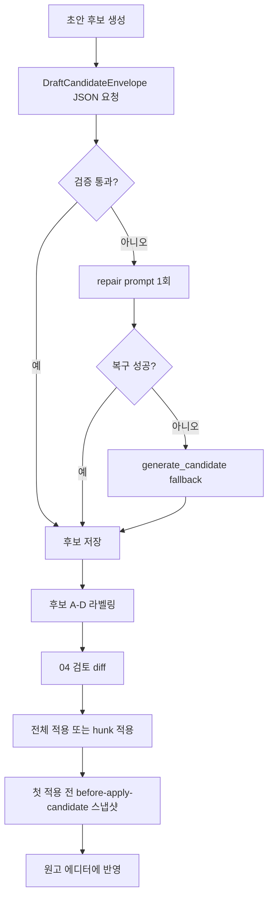
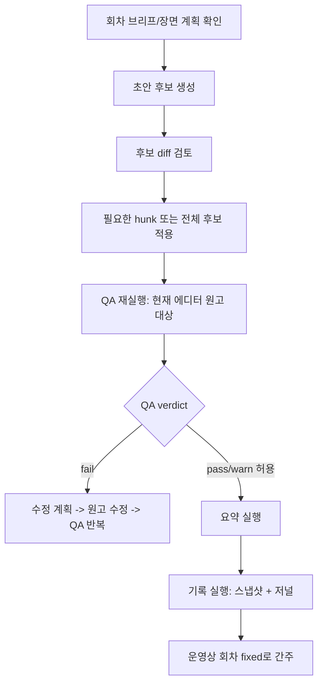

# AI 프로젝트/회차 파이프라인 도식

Updated: 2026-07-04
Status: current implementation map

이 문서는 Bindery의 현재 구현을 기준으로, 처음 프로젝트를 만드는 순간부터 AI 파이프라인을 거쳐 한 회차를 검토/기록하는 흐름을 정리한다. 핵심 분기는 `바이블/통합 문서가 있는 시작`과 `바이블 없이 시작`이다.

## 현재 결론

- `통합 문서` 시작은 구현되어 있다. 붙여넣기 또는 Markdown/TXT/DOCX 파일을 받아 `SourceIntake`로 분해하고, 선택적으로 AI 문맥 분해를 거친 뒤 하네스 파일을 쓴다.
- 분해 결과는 `canon/setting-bible.md`, `characters/`, `world/organizations.md`, `plot/plot-board.json`, `plot/open-threads.md`, `notes/source-intake.md`, `notes/source-raw.md`, `story/chapters/ep001/`로 들어간다.
- 회차별 AI 파이프라인은 9단계다: `회차 브리프 -> 장면 계획 -> 컨텍스트 -> 초안 후보 -> 표현 분석 -> QA -> 수정 계획 -> 요약 -> 기록`.
- `초안 후보`는 `회차 브리프`와 `장면 계획` 산출물이 없으면 실행되지 않는다.
- `QA`가 `fail`을 반환하면 `전체 실행`은 그 지점에서 중단되고, 이후 `수정 계획/요약/기록`으로 넘어가지 않는다.
- 현재 구현에서 "회차 픽스"는 별도 lock/status가 아니라 `기록` 단계의 스냅샷과 저널 산출물에 가깝다. 후보 적용 후 최종 QA와 `기록`을 다시 실행하는 운영이 실제 픽스에 가장 가깝다.
- 아직 구현되지 않은 큰 빈칸은 "바이블 전체에서 N화짜리 회별 아웃라인을 먼저 제안하고 승인받는 단계"다. 현재는 `SourceIntake`가 `ep001` 중심의 초기 플롯 보드를 만들고, 각 회차 선택 후 `EpisodeBrief/ScenePlan`이 회차별 계획을 만든다.

## 전체 시작 흐름

## 바이블/통합 문서가 있는 경우

이 경로는 사용자가 이미 작품 바이블, 시놉시스, 인물 메모, 세계관 문서, 플롯 메모를 갖고 있을 때의 흐름이다. 현재 UI에서는 `통합 문서` 탭이 이 역할을 한다.

### 통합 문서 분해 산출물

| 분해 대상 | 현재 저장 위치 | 역할 |
|---|---|---|
| 원문 보관 | `notes/source-raw.md` | AI refinement와 추후 검증의 원본 |
| 분해 보고서 | `notes/source-intake.md` | `bindery:source-intake-json` 포함, 분해 방식 기록 |
| 설정집 | `canon/setting-bible.md` | 세계 규칙, 전제, 인물, 조직, 첫 회차 플롯 씨앗 |
| 인물 인박스 | `characters/cast-inbox.md` | 분리된 인물 전체 목록과 정리 대기 메모 |
| 개별 인물 | `characters/{id}.md` | 감지된 인물별 기본 파일 |
| 조직/세력 | `world/organizations.md` | 조직, 세력, 기관, 팀, 길드 등 |
| 플롯 보드 | `plot/plot-board.json` | 현재 구현상 `ep001` 중심 초기 장면 row |
| 열린 떡밥 | `plot/open-threads.md` | 회차 브리프와 QA가 참고할 미해결 질문 |
| EP001 작업 메모 | `story/chapters/ep001/index.md` | 첫 회차 목표와 장면 씨앗 |
| EP001 원고 seed | `story/chapters/ep001/manuscript.md` | prose 확장 전 seed 원고 |

### AI 문맥 분해의 실제 계약

`AI 문맥 분해`가 켜져 있고 실행기가 준비되어 있으면, Bindery는 원천 텍스트를 명령 인자로 직접 넘기지 않는다. 먼저 `notes/source-raw.md`를 쓰고, 에이전트에게 그 파일을 읽으라고 요청한다.

에이전트 출력은 다음 조건을 통과해야 채택된다.

- JSON object로 파싱 가능해야 한다.
- `premise`가 충분히 길어야 한다.
- `characters`가 비어 있으면 안 된다.
- `plotBeats`가 비어 있으면 안 된다.
- `이름`, `나이`, `성격`, `말투`, 숫자, 버전 문자열 같은 필드명/표제어는 인물이나 플롯으로 승격하지 않는다.

검증에 실패하면 프로젝트 생성은 실패하지 않고 로컬 규칙 분해 결과를 그대로 사용한다.

## 바이블이 없는 경우

이 경로는 사용자가 설정집 없이 바로 쓰기 시작하거나, 기존 폴더에 `bible/canon/설정` 계열 Markdown 파일이 없는 경우다.

주의할 점: `새 작품`은 현재 Rust `create_project`가 기본 `canon/setting-bible.md` 템플릿을 만든다. 따라서 새 작품은 파일 기준으로는 "설정집 있음"처럼 감지된다. 내용이 비어 있거나 템플릿뿐이면 실제 정보량은 낮으며, 계획 산출물의 `risks`에 구체성 부족이 드러난다.

바이블 없이도 파이프라인은 돈다. 다만 입력 근거가 줄어들기 때문에 다음 단계들이 약해진다.

| 단계 | 바이블 없음 영향 |
|---|---|
| `회차 브리프` | `notes/source-intake.md`, `canon/setting-bible.md`, `characters/cast-inbox.md`가 없거나 빈 경우 현재 원고/플롯 보드/open threads 중심으로 로컬 브리프를 만든다. |
| `장면 계획` | 회차 브리프와 현재 원고 문단, 플롯 보드 row를 기준으로 장면 씨앗을 만든다. |
| `컨텍스트` | 이전 요약, 원고에 등장한 Codex 항목, 열린 떡밥이 없으면 비어 있음을 표시한다. |
| `초안 후보` | 브리프/장면계획만 있으면 실행되지만, 설정 충돌 방지력은 낮아진다. |
| `QA` | 회차 브리프/장면 계획/이전 요약/문체 지침이 없으면 해당 게이트의 근거가 약하다. |

## 회차별 AI 파이프라인

`AI 작업 -> 03 실행`과 `AI 미션 컨트롤`은 같은 runner를 사용한다. `runAll`은 아래 순서로 현재 회차를 실행한다.

### 단계별 상세

| 순서 | 단계 | 실행 성격 | 주요 입력 | 산출물 |
|---:|---|---|---|---|
| 1 | `회차 브리프` | Hybrid | `plot/plot-board.json`, `plot/open-threads.md`, 이전 요약, 현재 원고, source/canon/characters/organizations, Codex 요약 | `.bindery/artifacts/{episode}/episode-brief.md` |
| 2 | `장면 계획` | Hybrid | 회차 브리프, 플롯 보드 row, 현재 원고, source/canon/Codex | `.bindery/artifacts/{episode}/scene-plan.md` |
| 3 | `컨텍스트` | Static | 회차 브리프, 장면 계획, 이전 요약, 열린 떡밥, 원고 내 Codex 등장 항목 | `.bindery/artifacts/{episode}/context.md` |
| 4 | `초안 후보` | Hybrid | 현재 원고, 회차 브리프, 장면 계획, 문체 지침서, PromptCapsule, 컨텍스트/QA/수정/분석/요약 산출물, 집필 파라미터 | 후보 A-D, `.bindery/artifacts/{episode}/draft*.md` |
| 5 | `표현 분석` | Static | 현재 에디터 원고 | `.bindery/artifacts/{episode}/analyze.md` |
| 6 | `QA` | Hybrid | 현재 에디터 원고, 이전 요약, 문체 지침, 회차 브리프, 장면 계획 | `.bindery/artifacts/{episode}/qa.md` |
| 7 | `수정 계획` | Hybrid | QA 이슈와 QA 원문 | `.bindery/artifacts/{episode}/revise.md` |
| 8 | `요약` | Hybrid | 현재 에디터 원고 앞/중간/끝 발췌 | `.bindery/artifacts/{episode}/summarize.md`, `canon/summaries/{episode}.md` |
| 9 | `기록` | Static | 현재 에디터 원고 | 스냅샷, `.bindery/artifacts/{episode}/commit.md` |

`Hybrid`는 AI 실행기를 먼저 시도하고, 실패하거나 출력 검증에 실패하면 로컬/네이티브/mock fallback으로 내려가는 단계다. `Static`은 현재 구현상 AI 호출 없이 로컬 분석 또는 파일 작업으로 끝나는 단계다.

## 초안 후보와 검토

초안 후보는 원고를 직접 덮어쓰지 않는다.

현재 diff는 `현재 에디터 내용 -> 후보` 기준으로 계산된다. 후보 생성 당시 baseline을 별도 세션으로 고정해 diff하는 기능은 아직 계획 단계다.

현재 QA 버튼과 `runAll`의 QA는 선택된 후보가 아니라 `현재 에디터 원고`를 검사한다. 후보를 실제로 검수하려면 후보를 전체/부분 적용한 뒤 QA를 다시 실행하는 운영이 필요하다. 선택 후보 QA와 QA target metadata는 후속 계획에 있다.

## 한 회차를 "픽스"하는 현재 운영 기준

현재 구현에서 가장 안전한 픽스 흐름은 다음 순서다.

즉, "QA까지 지나서 완료되면 그 화는 픽스"라는 개념은 제품 방향과 맞지만, 현재 코드에는 `fixed` 상태를 파일 frontmatter나 별도 episode status에 자동 기록하는 로직은 없다. 지금은 `요약`과 `기록`이 그 역할의 evidence trail이다.

## 저장/추적 구조

| 종류 | 저장 위치 | 설명 |
|---|---|---|
| 원천 통합 문서 | `notes/source-raw.md` | AI refinement와 사람이 확인할 원문 |
| 분해 리포트 | `notes/source-intake.md` | source-intake JSON 포함 |
| 설정/세계/인물 | `canon/`, `characters/`, `world/` | 파이프라인 계획 입력 |
| 플롯 | `plot/plot-board.json`, `plot/open-threads.md` | EpisodeBrief/ScenePlan 입력 |
| 파이프라인 산출물 최신본 | `.bindery/artifacts/{episode}/{step}.md` | 단계별 최신 산출물 |
| 파이프라인 산출물 이력 | `.bindery/artifacts/{episode}/{step}-{timestamp}.md` | 단계별 이력 파일 |
| 산출물 인덱스 | `.bindery/artifacts/index.json` | UI 복원용 preview/index |
| run 기록 | `.bindery/runs/{runId}/run.json` | 설정 snapshot, 단계 상태, 산출물 id, 결정 로그 |
| run 인덱스 | `.bindery/runs/index.json` | Mission Control history 복원 |
| 회차 요약 | `canon/summaries/{episode}.md` | 다음 회차 연속성 입력 |
| 후보 적용 전 스냅샷 | snapshot backend | 첫 후보 적용 전에 생성 |
| 기록 스냅샷 | snapshot backend | `기록` 단계에서 생성 |

## 현재 구현과 후속 계획의 경계

| 항목 | 현재 상태 |
|---|---|
| 통합 문서 업로드/붙여넣기 | 구현됨: Markdown/TXT/DOCX/textarea |
| PDF 원천 문서 | 미구현, 후속 task |
| AI 문맥 분해 | 구현됨: 파일 기반 agent pass + 검증 + local fallback |
| 바이블 -> 다회차 아웃라인 제안 | 미구현, 후속 task |
| 회차 브리프/장면 계획 | 구현됨: agent-first + local fallback |
| 초안 후보 schema/repair | 구현됨 |
| QA schema/repair | 구현됨 |
| 선택 후보 QA | 미구현, 현재 QA는 current editor 대상 |
| QA fail 시 전체 실행 중단 | 구현됨 |
| live CLI event/token usage | 미구현, 관측성 계획 문서 단계 |
| fixed episode status/lock | 미구현, 현재는 `요약` + `기록` + 스냅샷으로 evidence를 남김 |
| candidate baseline diff | 미구현, 현재 diff는 live editor 기준 |

## 구현 기준 파일

- 시작 화면: `apps/desktop/src/lib/components/layout/MyBooks.svelte`
- 프로젝트 생성/열기 액션: `apps/desktop/src/lib/actions/project.ts`
- native 프로젝트 생성: `apps/desktop/src-tauri/src/commands/project.rs`
- 통합 문서 분해: `apps/desktop/src/lib/domain/sourceIntake.ts`
- DOCX 텍스트 추출: `apps/desktop/src/lib/domain/documentText.ts`
- 회차 브리프/장면 계획: `apps/desktop/src/lib/domain/planning.ts`
- 프롬프트 조립/9단계 정의: `apps/desktop/src/lib/domain/prompt.ts`
- 파이프라인 실행 액션: `apps/desktop/src/lib/actions/pipeline.ts`
- AI 작업 UI/runAll: `apps/desktop/src/lib/components/ai/AIStudio.svelte`
- Mission Control: `apps/desktop/src/lib/components/ai/mission/AIMissionControl.svelte`
- 산출물 저장: `apps/desktop/src/lib/stores/artifactStore.ts`
- run 기록: `apps/desktop/src/lib/stores/runStore.ts`
- 후보 diff/apply: `apps/desktop/src/lib/components/candidates/CandidateDiffPanel.svelte`
